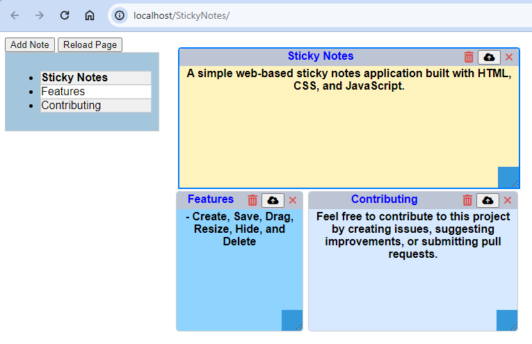

# Sticky Notes Web App

A simple web-based sticky notes application built with HTML, CSS, and JavaScript.



## Features

- Create and customize sticky notes.
- Drag and resize notes.
- Save and restore notes using local storage.
- Select and highlight notes in the list.
- Delete notes.
- Change note titles.

## Getting Started

1. Clone the repository:

```bash
git clone https://github.com/AhmedAglan/StickyNotes.git


Open the index.html file in your web browser.

Start creating, editing, and managing your sticky notes!

Usage
Click the "Add Note" button to create a new sticky note.
Click on a note to select it and make it active.
Edit the title by clicking on it.
Drag and resize notes using the mouse.
Delete a note by clicking the recycle bin icon.
Your notes are saved in local storage, so they'll persist between sessions.
Contributing
Feel free to contribute to this project by creating issues, suggesting improvements, or submitting pull requests.

License
This project is licensed under the MIT License - see the LICENSE file for details.

Acknowledgments
Inspired by the need for simple and user-friendly digital sticky notes.
